

[comment]: 

**UNIVERSIDAD PRIVADA DE TACNA**

**FACULTAD DE INGENIERIA**

**Escuela Profesional de Ingeniería de Sistemas**

**Proyecto *Análisis del Uso de Herramientas Tecnológicas en los proyectos de Estudiantes Sistemas UPT***

Curso: *Inteligencia de Negocios*

Docente: *Mag. Patrick Cuadros Quiroga*

Integrantes:

***Hernandez Cruz, Angel Gadiel (2021070017)*** 
***Paja de la Cruz, Piero Alexander (2020067576)***

**Tacna – Perú**

***2025***

**

|CONTROL DE VERSIONES||||||
| :-: | :- | :- | :- | :- | :- |
|Versión|Hecha por|Revisada por|Aprobada por|Fecha|Motivo|
|1\.0|MPV|ELV|ARV|18/03/2025|Versión Original|

**Sistema *Análisis del Uso de Herramientas Tecnológicas en los proyectos de Estudiantes Sistemas UPT***

**Documento de Especificación de Requerimientos de Software**

**Versión *{1.0}***
**

|CONTROL DE VERSIONES||||||
| :-: | :- | :- | :- | :- | :- |
|Versión|Hecha por|Revisada por|Aprobada por|Fecha|Motivo|
|1\.0|MPV|ELV|ARV|10/10/2020|Versión Original|

\pagebreak

# FD03 - Documento de Análisis y Diseño del Sistema

**ÍNDICE GENERAL**

- [1. Introducción](#1-introducción)
- [2. Generalidades de la Empresa](#2-generalidades-de-la-empresa)
  - [2.1 Nombre de la Empresa](#21-nombre-de-la-empresa)
  - [2.2 Visión](#22-visión)
  - [2.3 Misión](#23-misión)
  - [2.4 Organigrama](#24-organigrama)
- [3. Visionamiento de la Empresa](#3-visionamiento-de-la-empresa)
  - [3.1 Descripción del Problema](#31-descripción-del-problema)
  - [3.2 Objetivos de Negocios](#32-objetivos-de-negocios)
  - [3.3 Objetivos de Diseño](#33-objetivos-de-diseño)
  - [3.4 Alcance del Proyecto](#34-alcance-del-proyecto)
  - [3.5 Viabilidad del Sistema](#35-viabilidad-del-sistema)
  - [3.6 Información obtenida del Levantamiento de Información](#36-información-obtenida-del-levantamiento-de-información)
- [4. Análisis de Procesos](#4-análisis-de-procesos)
  - [4.1 Diagrama del Proceso Actual – Diagrama de Actividades](#41-diagrama-del-proceso-actual--diagrama-de-actividades)
  - [4.2 Diagrama del Proceso Propuesto – Diagrama de Actividades Inicial](#42-diagrama-del-proceso-propuesto--diagrama-de-actividades-inicial)
- [5. Especificación de Requerimientos de Software](#5-especificación-de-requerimientos-de-software)
  - [5.1 Cuadro de Requerimientos Funcionales Inicial](#51-cuadro-de-requerimientos-funcionales-inicial)
  - [5.2 Cuadro de Requerimientos No Funcionales](#52-cuadro-de-requerimientos-no-funcionales)
  - [5.3 Cuadro de Requerimientos Funcionales Final](#53-cuadro-de-requerimientos-funcionales-final)
  - [5.4 Reglas de Negocio](#54-reglas-de-negocio)
- [6. Fase de Desarrollo](#6-fase-de-desarrollo)
  - [6.1 Perfiles de Usuario](#61-perfiles-de-usuario)
  - [6.2 Modelo Conceptual](#62-modelo-conceptual)
    - [6.2.1 Diagrama de Paquetes](#621-diagrama-de-paquetes)
    - [6.2.2 Diagrama de Casos de Uso](#622-diagrama-de-casos-de-uso)
    - [6.2.3 Escenarios de Caso de Uso (Narrativa)](#623-escenarios-de-caso-de-uso-narrativa)
  - [6.3 Modelo Lógico](#63-modelo-lógico)
    - [6.3.1 Análisis de Objetos](#631-análisis-de-objetos)
    - [6.3.2 Diagrama de Actividades con Objetos](#632-diagrama-de-actividades-con-objetos)
    - [6.3.3 Diagrama de Secuencia](#633-diagrama-de-secuencia)
    - [6.3.4 Diagrama de Clases](#634-diagrama-de-clases)
- [7. Conclusiones](#7-conclusiones)
- [8. Recomendaciones](#8-recomendaciones)
- [9. Bibliografía](#9-bibliografía)
- [10. Webgrafía](#10-webgrafía)

---

## 1. Introducción
Documento técnico que establece el análisis y diseño del sistema para el proyecto "Análisis del Uso de Herramientas Tecnológicas en los proyectos de Estudiantes Sistemas UPT". Incluye modelos conceptuales, requerimientos y especificaciones técnicas basadas en los informes de factibilidad (FD01) y visión (FD02).

---

## 2. Generalidades de la Empresa

### 2.1 Nombre de la Empresa
**Universidad Privada de Tacna (UPT)**  
Escuela Profesional de Ingeniería de Sistemas

### 2.2 Visión
"Ser líder en formación tecnológica mediante la innovación educativa y el uso estratégico de herramientas digitales."

### 2.3 Misión
"Optimizar el uso de tecnologías en proyectos académicos para mejorar el rendimiento estudiantil y alinear las competencias con las demandas del mercado laboral."

### 2.4 Organigrama
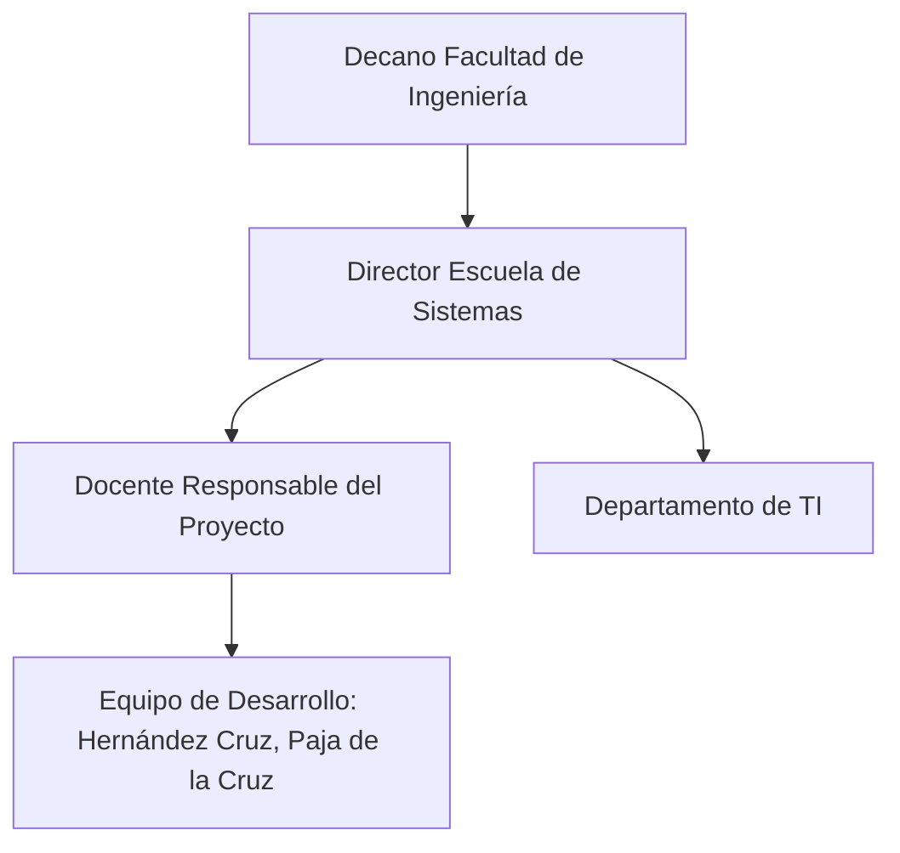
## 3. Visionamiento de la Empresa

### 3.1 Descripción del Problema
Los estudiantes de Ingeniería de Sistemas UPT subutilizan herramientas tecnológicas en sus proyectos académicos debido a:  
- Falta de estandarización en su uso  
- Brechas en capacitación  
- Acceso desigual a recursos (FD01, Sección 3.1)

### 3.2 Objetivos de Negocios
- Reducir en 30% el tiempo de análisis manual
- Identificar las herramientas tecnológicas más utilizadas  

### 3.3 Objetivos de Diseño
- Sistema automatizado de recolección de datos desde repositorios Git  
- Dashboards interactivos con Power BI  

### 3.4 Alcance del Proyecto
| Incluye | No Incluye |
|---------|------------|
| Análisis de lenguajes, frameworks y CI/CD | Proyectos fuera de la Escuela de Sistemas |
| Datos de repositorios públicos | Datos personales sin consentimiento |

### 3.5 Viabilidad del Sistema
**Técnica:** Uso de herramientas open-source (Python, Pandas)  
**Económica:** Costo total S/8,550 (FD01, 4.2)  
**Legal:** Cumple Ley N° 29733 (FD01, 4.4)  

### 3.6 Información del Levantamiento
- 90% de proyectos usan Git (FD02, 4.3)  
- Frameworks más mencionados: React, Django, Flask  

---

## 4. Análisis de Procesos

### 4.1 Diagrama del Proceso Actual
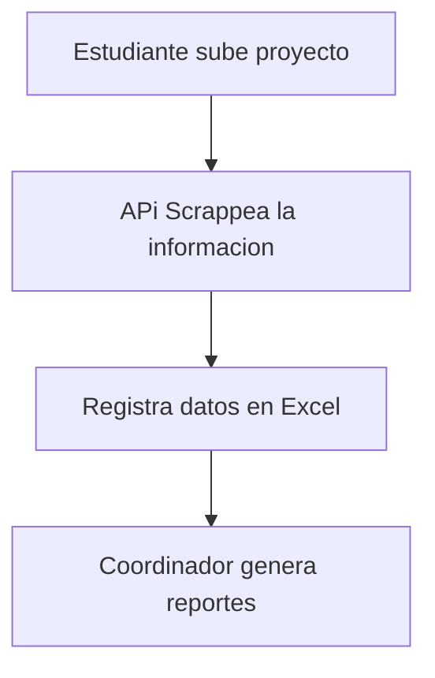
### 4.2 Diagrama del Proceso Propuesto
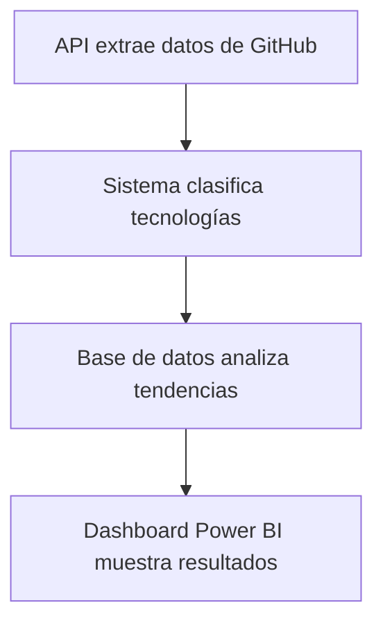

## 5. Especificación de Requerimientos de Software

### 5.1 Cuadro de Requerimientos Funcionales Inicial
| ID | Descripción | Prioridad |
|----|-------------|-----------|
| RF01 | Extraer metadatos de repositorios Git | Crítica |
| RF02 | Clasificar lenguajes por proyecto | Alta |
| RF03 | Generar reportes de frecuencia de tecnologías | Media |

### 5.2 Cuadro de Requerimientos No Funcionales
| ID       | Descripción                                                                 | Prioridad |
|----------|-----------------------------------------------------------------------------|-----------|
| RNF01    | El sistema debe analizar más de 500 repositorios GitHub sin fallar          | Alta      |
| RNF02    | Procesar 1 repositorio cada 30 segundos como máximo                         | Media     |
| RNF03    | Generar reportes con gráficos claros y datos completos                      | Alta      |

### 5.4 Reglas de Negocio
RN001: Solo analizar repositorios con licencia abierta

RN002: Anonimización de datos personales

RN003: Actualización semanal de métricas

RN004: Validación cruzada con 3 fuentes de datos

RN005: Retención de datos por 2 años académicos
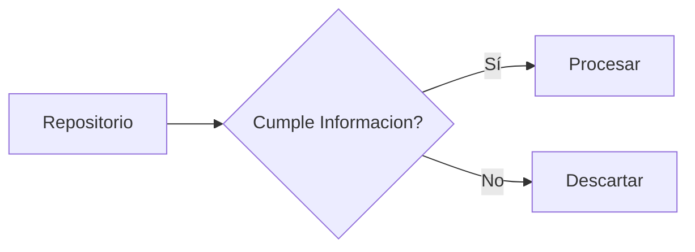
### 6. Fase de Desarrollo
### 6.1 Perfiles de Usuario
| ROL | PERMISOS | Casos de Uso |
|----|-------------|-----------|
| Estudiante | Lectura | Ver estadísticas personales |
| Administrador |  Total | Configurar parámetros del sistema|
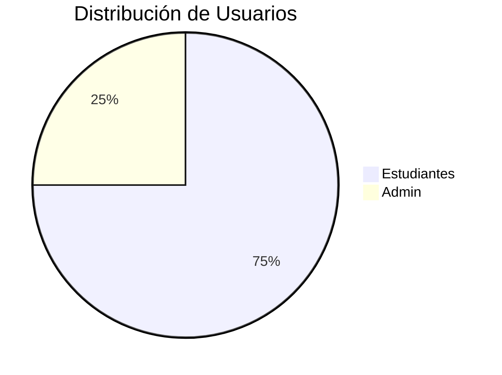
### 6.2 Modelo Conceptual
### 6.2.1 Diagrama de Paquetes
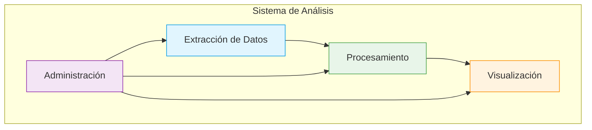
### 6.2.2 Diagrama de Casos de Uso
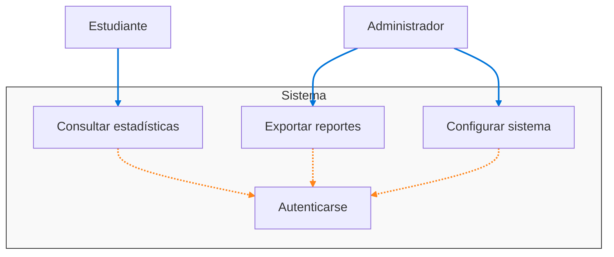

### 6.2.3 Escenarios de Caso de Uso (Narrativa)
**RF01 - Extraer metadatos de repositorios Git**  
*Flujo:*  
1. El sistema se conecta a la API de GitHub  
2. Autentica con token de acceso válido  
3. Recupera metadatos de repositorios estudiantiles  
4. Almacena datos en base de datos analítica  

**RF02 - Clasificar lenguajes por proyecto**  
*Flujo:*  
1. Analiza archivos .gitignore y manifestos (package.json, pom.xml)  
2. Detecta extensiones de archivos (.py, .java, .js)  
3. Asigna lenguaje principal usando heurísticas  
4. Genera registro de tecnologías por proyecto  

**RF03 - Generar reportes de frecuencia**  
*Flujo:*  
1. Agrupa proyectos por cohorte académica  
2. Calcula estadísticas de uso por tecnología  
3. Genera visualizaciones comparativas  
4. Permite exportar a PDF/CSV  

### 6.3 Modelo Lógico

### 6.3.2 Diagrama de Actividades con Objetos
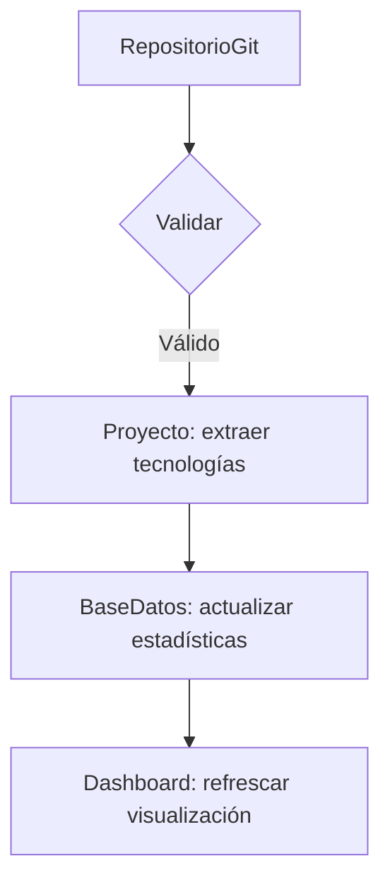
### 6.3.3 Diagrama de Secuencia
#### RF01 - Extracción de metadatos
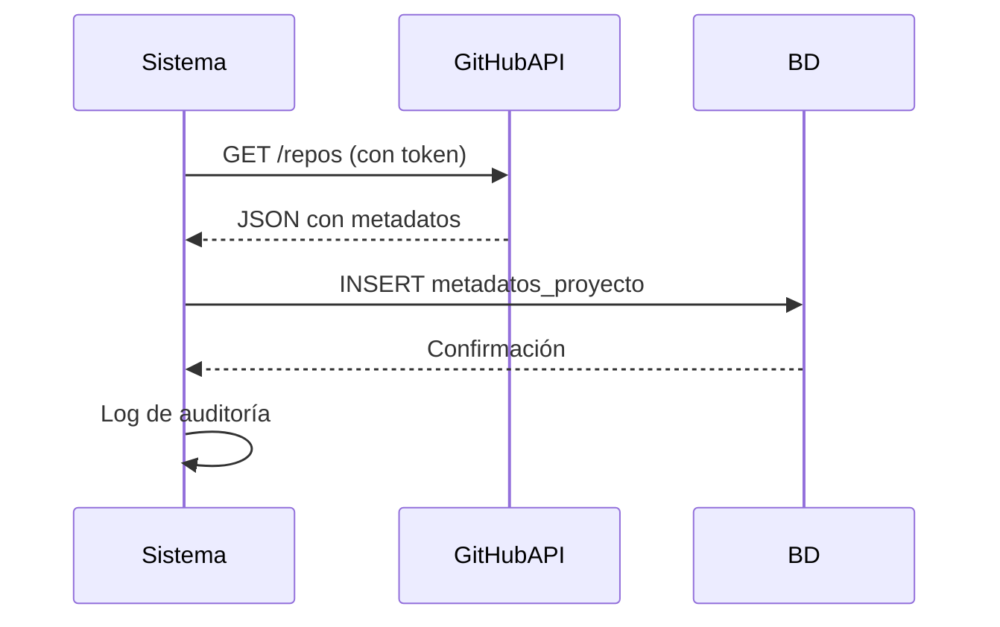
#### RF02 - Clasificación de lenguajes 
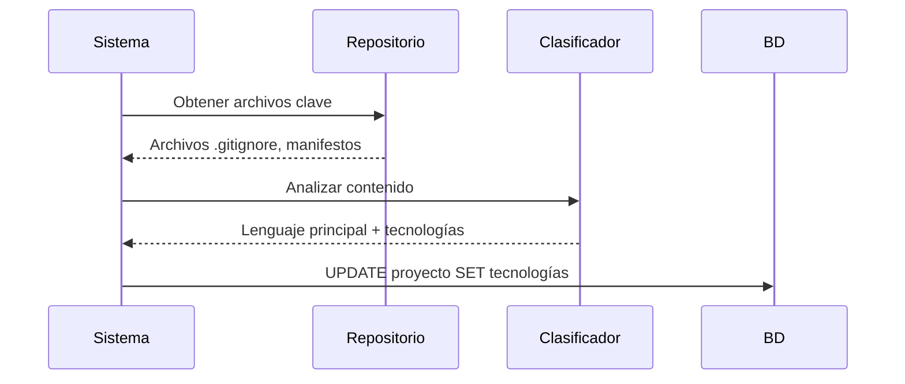
#### RF03 - Generación de reportes
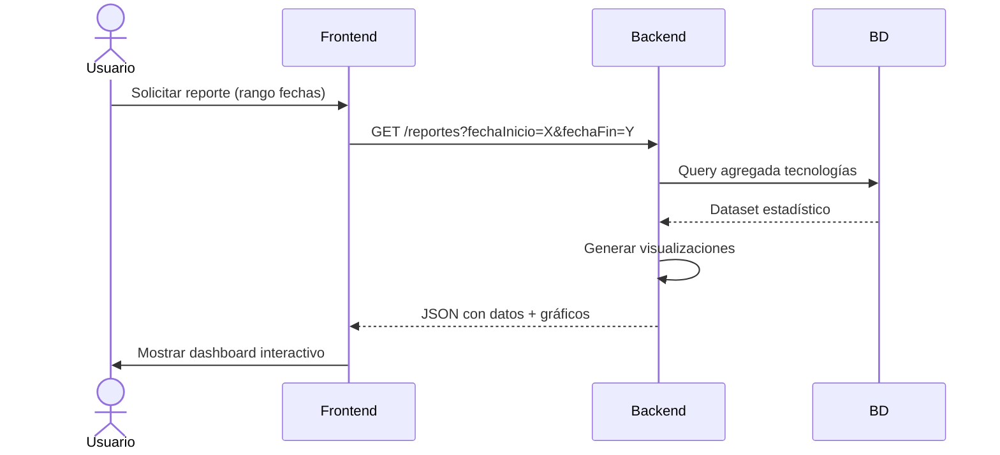
### 6.3.4 Diagrama de Clases
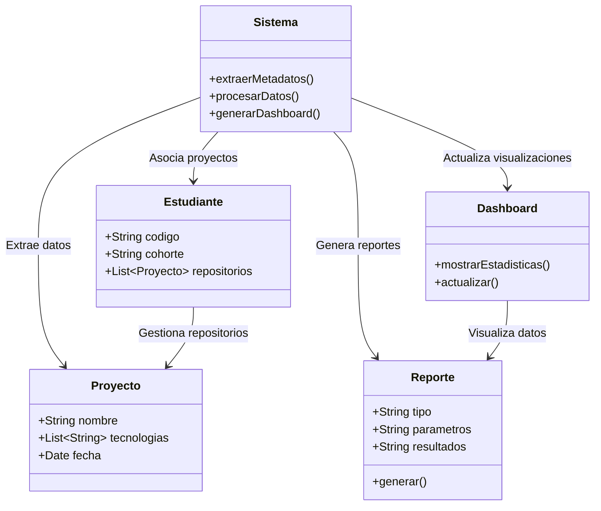
### 7. Conclusiones
El diseño propuesto es viable según el estudio de factibilidad (FD01) y responde a las necesidades identificadas en el documento de visión (FD02), con un costo controlado y alineamiento con los objetivos académicos.

### 8. Recomendaciones
Priorizar integración con GitHub API (FD02, 4.3)

### 9. Bibliografía
Documentos académicos UPT (FD02, 1.4)

IEEE 830-1998 para especificación de requerimientos

#### 10. Webgrafía
GitHub API v3

