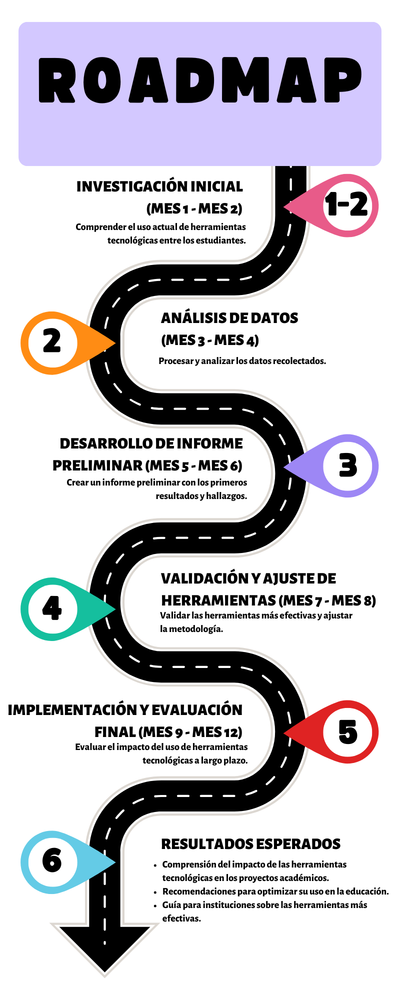

# Proyecto: Análisis del Uso de Herramientas Tecnológicas en los Proyectos de Estudiantes de Sistemas UPT

## Universidad Privada de Tacna
**Facultad de Ingeniería**  
**Escuela Profesional de Ingeniería de Sistemas**  

### Curso: Inteligencia de Negocios

**Docente:** Mag. Patrick Cuadros Quiroga

### Integrantes:
- **Hernandez Cruz, Angel Gadiel** (2021070017)  
- **Paja de la Cruz, Piero Alexander** (2020067576)  
### RoadMap:

