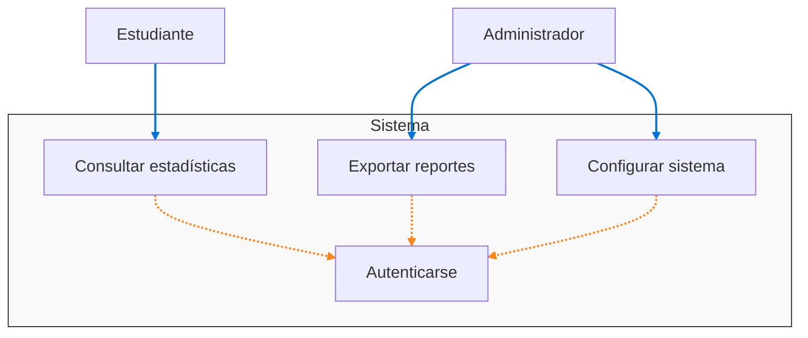

# Proyecto: Análisis del Uso de Herramientas Tecnológicas en los Proyectos de Estudiantes de Sistemas UPT

## Universidad Privada de Tacna
**Facultad de Ingeniería**  
**Escuela Profesional de Ingeniería de Sistemas**  

### Curso: Inteligencia de Negocios

**Docente:** Mag. Patrick Cuadros Quiroga

### Integrantes:
- **Hernandez Cruz, Angel Gadiel** (2021070017)  
- **Paja de la Cruz, Piero Alexander** (2020067576)  
### RoadMap:

## Funcionalidades Principales

-   **Automatización Completa del Proceso ETL**: El pipeline se ejecuta de forma automática, sin intervención manual, en cada cambio del código o de forma programada.
-   **Aprovisionamiento Dinámico de Infraestructura**: Utiliza Terraform para crear y configurar todos los recursos necesarios en Azure desde cero en cada ejecución, garantizando un entorno limpio y reproducible.
-   **Extracción de Datos de GitHub**: Se conecta a la API de GitHub para recopilar una amplia gama de datos: metadatos del repositorio, commits, issues, colaboradores y lenguajes de programación.
-   **Análisis de Tecnologías**: Analiza el contenido de los archivos `README.md` para detectar el uso de frameworks, librerías, bases de datos y herramientas de CI/CD.
-   **Almacenamiento Estructurado**: Carga los datos procesados en una base de datos relacional en Azure SQL, listos para ser consumidos por herramientas de BI.

## Requerimientos Funcionales

| ID | Descripción | Prioridad |
|----|-------------|-----------|
| RF01 | Extraer metadatos de repositorios Git | Crítica |
| RF02 | Clasificar lenguajes por proyecto | Alta |
| RF03 | Generar reportes de frecuencia de tecnologías | Media |
                        |

## Diagramas en Mermaid

### Diagrama de Arquitectura

### Diagrama de Casos de Uso

### Diagrama de Secuencia

#### RF01 - Extracción de metadatos

#### RF02 - Clasificación de lenguajes 

#### RF03 - Generación de reportes

## Reglas de Negocio

-   **Activación del Pipeline**: El pipeline se ejecuta con cada `push` a la rama `main` y de forma programada todos los lunes a las 3:00 AM UTC.
-   **Infraestructura Efímera**: La infraestructura en Azure (servidor y base de datos) se crea desde cero en cada ejecución del pipeline y no se destruye automáticamente. Esto garantiza un entorno limpio para cada carga, pero requiere una limpieza manual posterior si se desea controlar costos.
-   **Alcance del Análisis**: El script está configurado para analizar los primeros 50 repositorios (`scrap_pequeno.py`).
-   **Identificación de Cursos**: La asignación de un proyecto a un curso se basa en la detección de patrones como `si...` y `u...` en el nombre del repositorio. Si no se encuentra el patrón, el curso no se asigna.
-   **Detección de Tecnologías**: La identificación de frameworks, librerías, bases de datos y herramientas de CI/CD depende exclusivamente de su mención explícita en el archivo `README.md` del repositorio.

## Recomendaciones

-   **Estandarizar Nomenclatura**: Fomentar el uso de una convención de nombres estandarizada para los repositorios para mejorar la precisión en la identificación de cursos y unidades.
-   **Documentación en READMEs**: Incentivar a los estudiantes a documentar las tecnologías utilizadas en el `README.md` de sus proyectos para enriquecer los datos recopilados.
-   **Optimización de Costos**: Considerar añadir un paso de `terraform destroy` al final del pipeline o un pipeline separado para la limpieza de recursos en Azure y así evitar costos inesperados.
-   **Seguridad de Credenciales**: Las credenciales `AZURE_CREDENTIALS` y `GITHUB_TOKEN` deben ser gestionadas como secretos en GitHub y tener los permisos mínimos necesarios para operar.

## Enlace de Dashboard

*Aquí se puede colocar el enlace público al dashboard de Power BI una vez que esté disponible.*

`[Enlace al Dashboard de Power BI]` (Aún no disponible)
